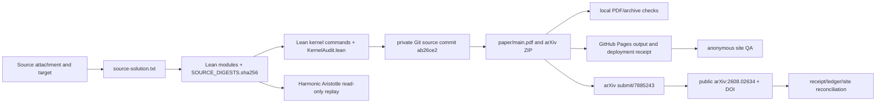

# Provenance workflow and reproducibility map

This document is a reconstruction of the dimension-two characteristic-two
counterexample from the preserved source, receipts, Git history, and chat-log
metadata. It is deliberately evidence-scoped: a local source check is not
called a hosted check, Harmonic Aristotle is corroboration rather than Lean,
and a submission receipt is not a public arXiv record. Raw chat logs are not
copied here; `CHAT_LOG_INDEX.md` records only identity metadata and digests.

## Workflow in one sentence

The supplied mathematical source was converted into a pinned Lean theorem,
closed through the exact Lean kernel, independently replayed by Harmonic
Aristotle, preserved in a private GitHub repository, packaged as a checked
ten-page preprint and source archive, published through an anonymous GitHub
Pages evidence site, submitted after the `math.AG` endorsement gate, and then
reconciled against the permanent public record `arXiv:2608.02634`.

## Chronology and evidence gates

### 1. Source attachment and target selection — 2026-07-26

The working input was the supplied source solution (the attachment is retained
outside this repository by the host). The target was fixed as the exact
dimension-two Jacobian counterexample over
`k = AlgebraicClosure (ZMod 2)`, including the explicit map, Jacobian one,
three-point collision, degree three, separability, etaleness, geometric
generic-fiber statement, and non-invertibility conclusion. The target was not
replaced by the easier `F₂` certificate.

The source tree was organized into `DimensionTwoCounterexample/` modules and a
root import. The pinned toolchain is Lean `v4.28.0` and Mathlib `v4.28.0`.
`SOURCE_DIGESTS.sha256` is the identity boundary for the 14 library files,
`KernelAudit.lean`, and the three pin/configuration files.

### 2. Formalization and closure of the algebraic chain — 2026-07-26

Early work proved the computational certificate uniformly in characteristic
two. Independent challenge identified the gaps that had to be closed before
the theorem could be called complete: nonzero denominators, algebraic
independence of `P,Q`, actual-field irreducibility, Gauss/rational-root
transport, `minpoly`/`finrank = 3`, separability, the graph-level etale proof,
and the separate geometric-degree bridge.

The repair strategy was explicit rather than an axiom or shortcut:

* use `CharTwo.two_eq_zero` after normalization instead of the obsolete
  `CharP.cast_eq_zero` route;
* prove value/constant-coefficient nonvanishing and transport it through the
  fraction-field maps;
* reconstruct `x`, `q`, and `y` from the hidden cubic root `w`, obtaining
  `L = E(w)` and algebraic independence;
* identify the actual target field with `k(P)(Q)` and apply a cubic
  rational-root/Gauss argument;
* derive the derivative, minpoly, finite rank, and separability facts; and
* use an explicit `RingHom` graph presentation for scheme etaleness and an
  explicit equivalence between function-field embeddings and the geometric
  generic fiber.

The source commits that mark this progression are shown with their exact Git
commit timestamps:

| Commit time | Commit | Evidence milestone |
| --- | --- | --- |
| `2026-07-26T17:54:03-04:00` | `dc2afb0f926b09cb2aea3fd8c87e58d0b46eda77` | partial-verification source checkpoint |
| `2026-07-26T17:59:12-04:00` | `8feed76e0a7752fab3a865115a0a23db7224d75b` | actual-field irreducibility kernel receipt |
| `2026-07-26T18:09:11-04:00` | `2fda12df3963f11e925a991068a0e48ca9ae259d` | geometric-bridge repair checkpoint |
| `2026-07-26T18:24:34-04:00` | `b509b9a314bf92b3ceeebafa5a57b1178928f9ca` | accepted geometric map leaves |
| `2026-07-26T18:36:35-04:00` | `42007b38178d2e8331db6d6421c6194f247c3325` | accepted hidden-root bridge |
| `2026-07-26T18:48:41-04:00` | `101775f37818fa18d0962d0a78e4f28d3bfe1453` | root and factorization proofs |
| `2026-07-26T18:59:27-04:00` | `1b25dc17d00d925b044fd83fe6ec4788b25305e7` | geometric generic-fiber bridge |
| `2026-07-26T19:07:48-04:00` | `ab26ce21e3b272eec73908d5ed2f8b10117f2e38` | complete terminal Lean kernel receipt |

The authoritative command set was:

```text
lake build +DimensionTwoCounterexample.GeometricBridge
lake build +DimensionTwoCounterexample.FinalTheorem
lake build DimensionTwoCounterexample
lake env lean KernelAudit.lean
```

The historical pinned cache accepted `8033/8033`, `8036/8036`, `8040/8040`,
and the audit reported only `[propext, Classical.choice, Quot.sound]`.
No project `sorry`, `admit`, custom axiom, `unsafe` proof shortcut, or weakened
replacement theorem was accepted. The `.lake` cache was later removed; these
receipts remain historical and a fresh cache-free local replay is not claimed.

### 3. Harmonic Aristotle corroboration — 2026-07-28 to 2026-07-29

Harmonic Aristotle was used as an independent challenger and replay service,
never as a replacement for Lean's kernel. The completed exact-source audit
(`97ef7042-8c3b-42cd-b52f-66cbb590a41a` /
`d88c517d-a5f4-43db-93a3-c17304d3e7e6`) matched all Lean source digests and
resolved dependency revisions, then reproduced the four exact commands. Its
manifest normalization changed only the byte layout of `lake-manifest.json`,
not package revisions. Its axiom output matched the local receipt.

The broad Aristotle challenge (`cc2dd61e-1099-4f0b-a266-fbe824a18c48` /
`df979f63-bc0f-4fee-a3a9-c45005ca09b2`) and bounded specialist lanes were
retained as challenge evidence. An exact terminal-source attempt
(`9eba69f5-f139-4163-a88e-723ba994d52a` /
`8587db81-b10c-4315-a74a-01a8a32d5fff`) ended `OUT_OF_BUDGET`; it is not a
kernel receipt. The independent read-only audit is the successful replay.

### 4. Git preservation — 2026-07-26 through 2026-07-28

The kernel source was preserved non-forcefully in the private repository
`integrate-your-mind/dimension-two-jacobian-counterexample` on branch
`partial-verification-2026-07-26`; source identity is
`ab26ce21e3b272eec73908d5ed2f8b10117f2e38`. The later publication branch is
`publication-preprint-site-2026-07-28`; its pre-reconciliation base commit is
`06581844818317fcd179e0ca7ebda1c64272c174`.

Preservation included source, receipts, the closure ledger, the formalization
map, the pinned manifest, paper source, and site source. It excluded secrets,
credentials, raw chat JSONL, caches, and generated bulk output except for the
explicit release artifacts whose hashes are frozen below.

### 5. Preprint and arXiv bundle — 2026-07-29

The manuscript was built with `paper/build-pdf.sh` (exit 0, pdfTeX 1.40.29 /
TeX Live 2026), visually inspected across ten letter-size pages, and checked
for references, fonts, overfull boxes, theorem text, and metadata. The source
archive was created with `bash paper/make-arxiv-bundle.sh` (exit 0), then
unpacked and compiled by `bash paper/verify-arxiv-bundle.sh` (exit 0); `unzip
-t` passed for every entry.

Frozen release identities:

| Artifact | Bytes | SHA-256 |
| --- | ---: | --- |
| `paper/main.pdf` | 371,445 | `85321960fa818a00581aaac99b1b57a52a329a843c277e564a097894196f979a` |
| `paper/dimension-two-counterexample-arxiv.zip` | 50,763 | `bc8010009f178b9013ea2a8c656f12df159cc6156c1e53eaf23d0d235596f478` |

The relevant publication commits are `d7e2ed2` (PDF/archive verification),
`5d05885` (preprint/site package), `6dd53e7` (deployment receipt), `a8f3f5d`
(published hashes), `24c93ec` (pinned downloads), `08c53cf` (version-two
receipt), `c7cf1fb` (whitespace matcher repair), `9476ef3` (version-three QA),
`1f5179e` and `3b72bd4` (hosted startup diagnostics), `8bf8ab2` (release
visualization), and `0658184` (temporary arXiv receipt).

### 6. Site QA and deployment — 2026-07-29

The public output-only GitHub Pages repository
`integrate-your-mind/integrate-your-mind.github.io` was initially finalized at
commit `67595c8b2470968aef3b1ced218fd8e583245db6`; its anonymous URL is
`https://integrate-your-mind.github.io/`. The public PDF and ZIP were checked
byte-for-byte against the frozen hashes, all evidence copies matched, links
and anchors resolved, the HTML retained the explicit characteristic-two scope,
and the interactive collision/etale/generic-fiber controls were read back
from the production DOM.

GitHub Actions startup-failure runs created zero jobs and are recorded as
unavailable hosted-CI evidence, not as successful CI. Local
`npm ci`, lint, typecheck, build, and test passed; the test initially failed on
superseded PDF/ZIP hashes and was repaired before the final pass.

### 7. Endorsement and submission — 2026-07-29

The new-account `math.AG` endorsement was confirmed at 2026-07-29 20:17:36
America/New_York. The authorized source archive, metadata, license, and
category were submitted as `arXiv:submit/7885243`. The temporary receipt was
not treated as a publication identifier. The generated arXiv PDF was inspected
against the local ten-page release before final submission.

### 8. Public arXiv record — 2026-08-06 verification

The permanent public record is [arXiv:2608.02634](https://arxiv.org/abs/2608.02634)
with DOI [10.48550/arXiv.2608.02634](https://doi.org/10.48550/arXiv.2608.02634).
It carries the published title, Romy Mondello as author, the characteristic-two
abstract, primary `math.AG` classification, and the ten-page paper. This
external record supersedes the temporary `submit/7885243` status.

### 9. Post-publication reconciliation — 2026-08-06

This source update replaced the temporary submission state in the publication
receipt, closure ledger, metadata record, site metadata, calls to action, and
verification workflow. It also added the public arXiv source and DOI links, a
real `robots.txt`, this redacted workflow map, and a machine-readable
provenance manifest. The temporary number remains only where needed to connect
the final record to its historical submission receipt. The formal Lean theorem
source and its digest boundary were not changed by publication.

## Authority and privacy boundaries

* The Lean kernel and its exact command/axiom receipt are authoritative for
  formal verification.
* Harmonic Aristotle is an independent challenge/replay and cannot upgrade an
  unformalized claim or replace Lean.
* Local PDF, ZIP, and site checks prove only the artifacts and environment they
  actually exercised; hosted CI startup failures are not passes.
* arXiv's public record and DOI are the publication receipt; the temporary
  `submit/7885243` number is only a submission receipt.
* The private source repository contains full Lean history; the public Pages
  repository is output-only and contains no private history, credentials, or
  raw chats.
* Chat records remain private local append-only logs. This packet stores only
  basenames, IDs, time ranges, byte sizes, and complete-file or stable-prefix
  SHA-256 receipts. It never copies raw chat bodies.

## Evidence architecture and reproducibility graph



At every edge, the next node is only claimed at the evidence level recorded in
the corresponding receipt. The graph intentionally keeps formal verification,
external corroboration, artifact construction, deployment, and publication as
separate gates.
